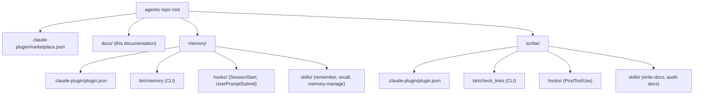

# Architecture

Agentix is a collection of agent tools packaged as Claude Code plugins. The
repo root doubles as a Claude Code plugin marketplace: one `marketplace.json`
manifest lists the plugins, and each plugin is a self-contained folder.

## Repo layout

The marketplace manifest points at each plugin folder (`"source": "./memory"`).
Claude Code copies installed plugins into its own cache, so edits here only
take effect after `/plugin marketplace update` plus reinstall or
`/reload-plugins` — see [setup](setup.md#developing).

## Anatomy of a plugin

Every plugin follows the same shape:

- `.claude-plugin/plugin.json` — name, version, and hook definitions. Hooks
  reference their scripts via `${CLAUDE_PLUGIN_ROOT}`, which Claude Code
  resolves to the installed plugin location.
- `bin/` — a standalone CLI that does the real work. Hooks and skills are
  thin wrappers around it, and it stays usable from a plain shell.
- `hooks/` — small Python scripts reading hook JSON on stdin. They must be
  fast and silent when they have nothing to say.
- `skills/<name>/SKILL.md` — model-facing instructions with trigger
  descriptions in the frontmatter.
- `README.md` — plugin-level usage documentation.

## Conventions

- **Standard library only.** The host Python (currently 3.14 via mise) has no
  guaranteed third-party packages, and plugins must not require a package
  manager. Anything needing more (embeddings, HTTP services) is an external
  process spoken to over HTTP.
- **Degrade gracefully.** A missing backing service must never break the
  primary function — memory falls back from vector to full-text search;
  scribe's hook stays silent on timeout rather than blocking edits.
- **Hooks announce, skills instruct.** Absolute paths differ per install, so
  SessionStart hooks print the resolved CLI paths into context, and skills
  reference `${CLAUDE_PLUGIN_ROOT}` with that announcement as fallback.
- **State under `~/.config/agentix/<plugin>/`.** Never inside the repo or the
  plugin cache, both of which are disposable.

## Plugins

- [memory](memory.md) — long-term memory: SQLite, FTS5, vector search,
  auto-recall hooks.
- [scribe](scribe.md) — documentation discipline: markdown style, mermaid
  diagrams, automatic link checking.
