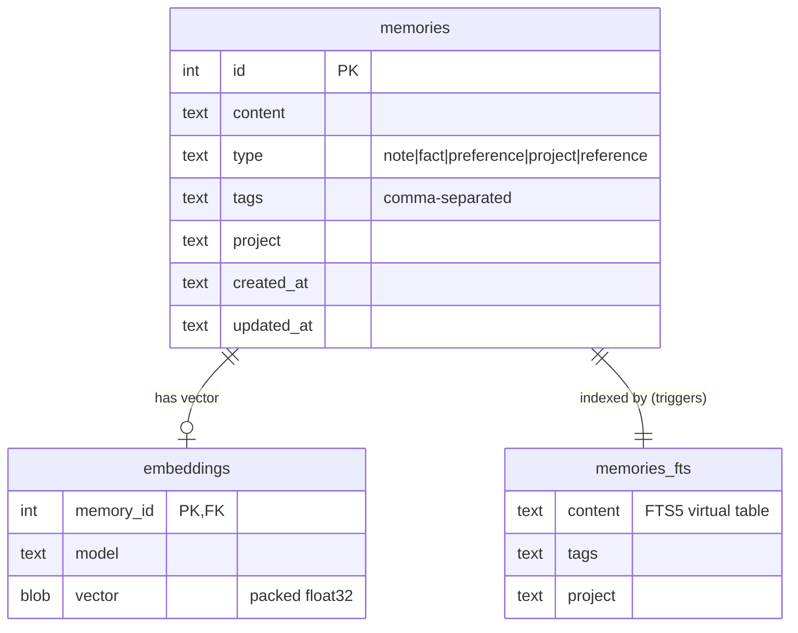
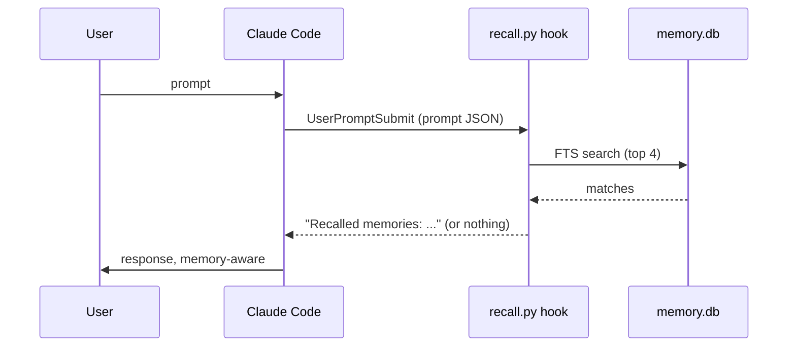

# Memory plugin

Long-term memory for Claude Code. Facts, preferences, and project context are
stored in SQLite and recalled across sessions — automatically via hooks, or
deliberately via the CLI and skills. Pure Python standard library; no
dependencies to install.

## Storage

Everything lives in `~/.config/agentix/memory/` (override with the
`AGENTIX_MEMORY_DIR` environment variable):

- `memory.db` — SQLite database, WAL mode
- `config.json` — embedding provider configuration



The FTS5 index is kept in sync by SQLite triggers on insert, update, and
delete. Embedding rows are tagged with the model that produced them; vectors
from a different model are ignored at search time, so switching models just
means re-running the backfill.

## CLI

The CLI is `memory/bin/memory`. The plugin's SessionStart hook prints its
absolute path at the start of every session.

```bash
memory add "User prefers rebase over merge" --type preference --tags git
memory search "git workflow"                # hybrid (default)
memory search "rebase" --mode fts           # keyword only
memory search "how do I merge" --mode vector
memory list -n 20 --type preference
memory get 3
memory edit 3 --content "..." --tags git,workflow
memory delete 3
memory embed                                # backfill missing embeddings
memory stats
memory config --set embedding.provider=openai
```

Search and list accept `--type`, `--project`, and `--tag` filters, plus
`--format text|json|context` (`context` is the compact single-line form used
for hook injection).

## Search modes

- **fts** — SQLite FTS5, bm25-ranked. Query text is sanitized into quoted
  OR-joined tokens, so FTS5 operator syntax in a query cannot break it.
- **vector** — the query is embedded, then compared by cosine similarity
  against all stored vectors for the active model. Brute force in Python,
  which is fine at personal-memory scale (thousands of rows).
- **hybrid** (default) — both of the above, fused with reciprocal rank fusion
  (score `1 / (60 + rank)` summed per ranking). Falls back to fts alone, with
  a warning, when the embedding provider is unreachable.

## Embeddings

Configured in `config.json` (edit directly or use `memory config --set`):

- `ollama` (default) — local Ollama at `http://localhost:11434`, model
  `nomic-embed-text`. One-time setup:

  ```bash
  systemctl start ollama
  ollama pull nomic-embed-text
  memory embed
  ```

- `openai` — any OpenAI-compatible `/v1/embeddings` endpoint. API key is read
  from the environment variable named by `embedding.api_key_env`
  (default `OPENAI_API_KEY`).
- `none` — disables embeddings; full-text search keeps working.

Degradation is graceful everywhere: with no embedder reachable, `add` stores
the memory without a vector and warns, hybrid search falls back to full-text,
and `memory embed` backfills once a provider is up.

## Claude Code integration

Two hooks (defined in `memory/.claude-plugin/plugin.json`):

- **SessionStart** — announces the tool, the CLI path, memory counts, and the
  most recent memories.
- **UserPromptSubmit** — runs a fast FTS search on each prompt and injects up
  to four keyword-relevant memories as context. Skipped for slash commands,
  prompts under 12 characters, and when nothing matches. FTS only, so the
  per-prompt cost stays a few milliseconds.



Three skills:

- `remember` — save a memory; searches for duplicates first and prefers
  `memory edit` over creating near-duplicates.
- `recall` — deliberate lookup, including semantic (`--mode vector`) when the
  user's phrasing differs from the stored wording.
- `memory-manage` — list, edit, delete, stats, embedding backfill and
  provider configuration.
