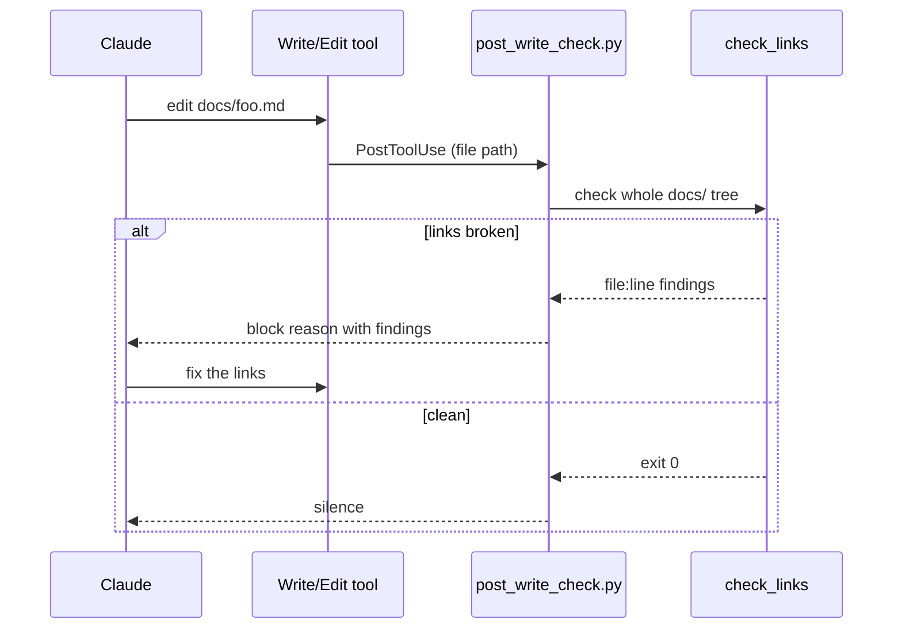

# Scribe plugin

Documentation discipline for Claude Code. Scribe enforces one convention —
clean markdown under `./docs`, mermaid diagrams for flows and hierarchy — and
verifies every link after every docs edit. Pure Python standard library.

The plugin is named `scribe` rather than `docs` because its own rule reserves
the `docs/` path for project documentation (including this repo's).

## Link checker

`scribe/bin/check_links` validates markdown documentation:

```bash
check_links docs                 # relative links, anchors, mermaid fences
check_links docs --external      # also probe http(s) URLs
check_links docs/setup.md        # single file
check_links docs --root .        # base for repo-absolute /docs/x.md links
```

It reports `file:line: problem` and exits 1 on findings. Checked per file:

- relative and repo-absolute link targets exist (files or directories)
- anchors resolve — same-file `#heading` and cross-file `other.md#heading`,
  using GitHub slug rules including `-1`/`-2` suffixes for duplicate headings
- reference-style links (`[text][label]`) point to defined labels, and the
  definitions themselves resolve
- code fences are closed; links inside fences and inline code are ignored
- mermaid fences are non-empty and start with a known diagram type
- with `--external`: http(s) URLs respond (HEAD first, GET fallback for
  servers that reject HEAD)

## The feedback loop

A PostToolUse hook (`scribe/hooks/post_write_check.py`) fires after every
Write or Edit. When the target is a markdown file under `./docs`, it checks
the **whole** docs tree — not just the edited file — so links elsewhere that
the edit broke (renamed files, deleted headings) are caught too. Findings are
returned as a blocking reason, which puts them straight in front of Claude to
fix.



External URLs are skipped in the hook to keep edits fast; the `audit-docs`
skill covers them.

## Skills

- `write-docs` — the house style: everything under `./docs` indexed from
  `docs/README.md`, one H1 per file, sentence-case headings, language-tagged
  fences, relative links, and a mermaid diagram whenever a flow or hierarchy
  is explained (with a diagram-type selection guide).
- `audit-docs` — full sweep: link check with `--external`, orphan detection
  (docs unreachable from the index), and staleness spot-checks of doc claims
  against the code.
