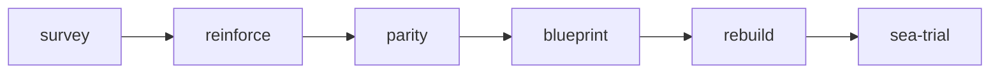

# Shipwright

Shipwright rebuilds an existing app in Rust through a checkpointed,
cost-tiered agent pipeline. The founding principle: the original app is the
**oracle**. Tests written against it become the specification; the port is
verified by asking both implementations the same questions and demanding a
deliberate, recorded decision for every difference.

The approach follows what worked in real agent-driven rewrites (Ladybird's
C++→Rust adoption, Bun's Zig→Rust porting rules, Cloudflare's vinext):
tests-as-spec before any porting, structure-preserving translation with
mandatory honesty markers instead of silent guessing, and adversarial review
by a separate model.

## Pipeline



Each phase is a skill; between phases the pipeline stops and waits for a
go-ahead, naming the next phase's cost profile first.

| Phase | Deliverable | Gate to complete |
|---|---|---|
| survey | feature matrix, findings ledger, port order, coverage map | at least one feature recorded |
| reinforce | unit/integration tests pinning current behavior | — |
| parity | one e2e suite runnable against old and new, baselined | every feature has `e2e-old` |
| blueprint | preserve/fix decisions, crate + license table, hexagonal design, scaffold | no finding left `pending` |
| rebuild | the ported app, tests-first, batch by batch | every feature `tests-ported`, `implemented`, `documented` |
| sea-trial | differential verification, final report | every feature has `e2e-new` |

## State

One JSON file in the original repo, `.shipwright/state.json`, holds three
things (managed by `bin/shipwright`, which takes an exclusive lock so
parallel subagents can write concurrently):

- **Phase checkpoints** — pending / in progress / complete, with gates.
- **Feature parity matrix** — every externally observable feature, with five
  flags tracking it through the pipeline: `e2e-old`, `tests-ported`,
  `implemented`, `documented`, `e2e-new`.
- **Findings ledger** — every bug, smell, or risk found in the original.
  Each carries a decision: `preserve` (bug-for-bug compatibility) or `fix`
  (deliberate behavior change, encoded in the parity suite and documented).
  Decisions are made by the human, never by an agent, and `blueprint`
  cannot complete while any finding is undecided.

`shipwright report` renders all of it as markdown, including the list of
deliberate behavior changes — the rewrite's release notes.

## Subagents and cost tiers

The main thread only orchestrates. Work fans out to plugin-defined agents,
each pinned to the cheapest model that does its job well:

| Agent | Model | Role |
|---|---|---|
| inventory-scout | Haiku | mechanical enumeration: features, tests, deps |
| code-surveyor | Opus | architecture judgment, port order, hidden invariants |
| bug-hunter | Opus | adversarial defect hunt into the findings ledger |
| test-smith | Sonnet | characterization tests (unit, integration, e2e) |
| crate-scout | Sonnet | crate research via Context7 + license verdicts |
| porter | Sonnet | one-module structure-preserving port, tests first |
| sea-trial-judge | Opus | adversarial old-vs-new drift hunting |

Fable is never a default: it is the escalation tier, used when the blueprint
rates a module *gnarly* or when a module fails judge review twice.

## Porting rules (phase A)

Porters translate faithfully and mark honestly rather than improving
silently:

- Tests are ported before the implementation they verify.
- Structure-preserving: same names, field order, control flow — reviewable
  side by side with the original. Idiomatic refactoring is a later, separate
  effort.
- `// TODO(port): reason` wherever confidence is low — a flagged gap beats
  plausible-but-wrong code. `// PERF(port)` for flattened performance
  idioms, `// SAFETY:` on any `unsafe`, and a PORT STATUS footer (source
  path, confidence, open TODO count) in every ported file.
- Only blueprint-approved crates; every crate verified on crates.io
  (`shipwright crate check`) with a permissive-license allowlist enforced by
  cargo-deny.

## House Rust style

The `rust-codestyle` skill bundled with the plugin defines the style every
porter follows — usable on its own for any Rust work, not just rewrites. It
ships a terse rule reference, a full guide, a minimal-service template, an
error-handling rationale, and a ~140-rule workspace lint table
(`lints.toml`, installed verbatim by the blueprint's scaffold step). The
non-negotiables: `error-stack` + `thiserror` (derive only, never `#[from]`)
in library code with `eyre` in main, structured tracing fields (never
interpolation), `pub(crate)` by default, `it_should_…` test names with
`assert2`, pinned dependency versions, `unsafe_code` denied, hard tabs.

## CLI reference

```bash
shipwright init --name app --kind api|cli|web|worker|library|mixed --target ../app-rs
shipwright status [--format human|context|json]
shipwright phase list | start P | complete P [--force] | reopen P
shipwright feature add NAME --kind endpoint|command|page|job|behavior|other
shipwright feature set ID FLAG on|off
shipwright feature list [--pending FLAG] [--format json]
shipwright finding add DESC --kind bug|smell|risk|perf --severity low|medium|high --where LOC
shipwright finding decide ID preserve|fix --note WHY
shipwright finding list [--decision pending|preserve|fix]
shipwright crate check NAME...   # crates.io: version, license, verdict
shipwright report                # full markdown report
```

A SessionStart hook announces any active rewrite found in (a parent of) the
working directory, so a fresh session resumes with `/shipwright:status`.
