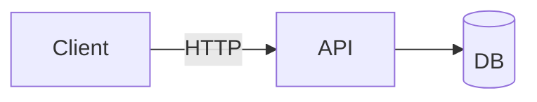

# Write docs

## Location

All project documentation lives under `./docs` in the repo root. No exceptions:
not in the code tree, not in a wiki folder, not scattered README files.
(The repo root `README.md` stays — keep it short and link into `./docs`.)

Layout for anything beyond a couple of files:

```
docs/
  README.md          # index: what's here, where to start
  architecture.md    # system shape, components, data flow
  setup.md           # install / run / develop
  <topic>.md         # one topic per file, kebab-case names
  adr/               # decision records, if the project uses them
```

Every doc must be reachable by links starting from `docs/README.md`.

## Clean markdown

- Exactly one `#` H1 per file, first line. Heading levels never skip (## → ###).
- Sentence case headings ("Request lifecycle", not "Request Lifecycle").
- Short paragraphs. Lists for enumerations, tables only for grid-shaped facts.
- Fenced code blocks always carry a language tag (```bash, ```json, ...).
- Relative links between docs (`[setup](setup.md)`, `[api](../docs/api.md)` from
  outside). Never absolute filesystem paths; repo-absolute `/docs/x.md` only
  when relative would be confusing.
- Link to code with a path (`src/server.py`), not a copy of the code, unless a
  snippet is genuinely illustrative. Snippets go stale.
- No HTML unless markdown truly cannot express it.
- Write for the reader who just arrived: define project-specific terms on first
  use, no unexplained abbreviations.

## Mermaid diagrams

When explaining a **flow** (request lifecycle, pipeline, state changes) or a
**hierarchy** (components, ownership, module structure), include a mermaid
diagram — prose alone is not enough. Pick the matching type:

- `flowchart TD` / `flowchart LR` — hierarchy, components, decision flows
- `sequenceDiagram` — interactions between services/actors over time
- `stateDiagram-v2` — lifecycle/state machines
- `erDiagram` — data models
- `classDiagram` — type/ownership structure

Keep diagrams small (≤ ~15 nodes); split rather than cram. Label edges. A
diagram supplements a short prose explanation, never replaces it.



## After every write — check links

After each Write/Edit to a docs file, run:

```bash
python3 "${CLAUDE_PLUGIN_ROOT}/bin/check_links" docs
```

(A PostToolUse hook also runs this automatically and reports breakage.)
Fix everything it reports before moving on: update the link, restore the
heading, or fix the path — whichever restores truth. When you rename or delete
a doc file or heading, the tree-wide check catches inbound links you broke;
update those too. For a full sweep including external URLs use the
`audit-docs` skill.
